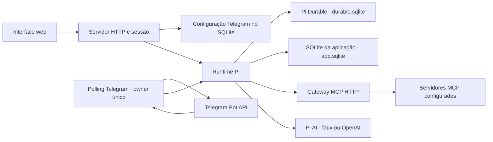

# Arquitetura e limites

## Runtime e dados

Node.js 24 ou superior executa o servidor HTTP, a interface estática e o runtime Pi no mesmo processo. `@earendil-works/pi-durable` 1.0.4 mantém conversas, tarefas e histórico em `durable.sqlite`; `@earendil-works/pi-ai` 1.0.4 fornece o provider faux no modo demo e OpenAI no modo live. As credenciais emitidas pelo login do Pi AI passam por um `CredentialStore` SQLite em `app.sqlite`; não há `auth.json` separado. A base de ações usa `synchronous=FULL`; o adapter Pi usa WAL com `NORMAL`, suficiente para crash do processo, sem garantia de preservar o último commit em falha de energia do host. As duas bases ficam em `DATA_DIR` (localmente `./data`; no Compose `/app/data`).

`app.sqlite` também contém sessões web, requisições idempotentes, leituras MCP, propostas, vínculos de Telegram, recibos de updates, offset de polling e fila de entregas. O token Telegram conectado é guardado nessa base dentro do volume privado: diretórios `0700`, arquivos SQLite `0600`. O token não é retornado por APIs nem escrito nos logs. Isso restringe acesso ao arquivo, sem acrescentar uma garantia de criptografia. A interface recebe snapshots por SSE, incluindo o texto parcial já persistido, com atualização local a cada 500 ms. O stream encerra quando a sessão expira ou é revogada. O service worker só assume o controle na instalação e ativação; histórico e credenciais sempre vêm do servidor autenticado.

O serviço adquire um `proper-lockfile` em `DATA_DIR/owner.lock` (diretório de lease) dentro do volume de dados antes de abrir e recuperar as bases: heartbeat de 10 s, lock considerado obsoleto após 30 s e nenhuma espera para outra instância. Rode apenas um owner por diretório/volume. No início, ações que ficaram em `running` e entregas que ficaram em `sending` são marcadas `uncertain`; não são repetidas automaticamente. Requisições ainda `pending` são retomadas. A recuperação percorre todas as conversas em páginas de 1.000 registros.

## Login e provider

O login web usa `WEB_PASSWORD` ou `WEB_PASSWORD_FILE` (mínimo de 12 caracteres), limite de tentativas e cookie `HttpOnly`, `SameSite=Strict`, com duração de 24 horas. Requisições de escrita devem trazer a origem exata configurada em `APP_ORIGIN`; `COOKIE_SECURE=true` adiciona o atributo Secure para uso atrás de TLS.

No modo live, a interface inicia `models.login('openai', 'oauth')` do Pi AI e mostra eventos, links de autorização e prompts interativos. O `SqlCredentials` persiste as credenciais do provider em `app.sqlite`. Esse login não é o login web. O modo demo usa respostas locais e não acessa contas externas.

## Ações e MCP

O gateway usa Streamable HTTP e tenta SSE legado somente após resposta 404 ou 405 na inicialização sem sessão. HTTP é permitido apenas em loopback para mocks locais; não há transporte `stdio`. A configuração usa `name`, `url`, token e o `mode` por servidor. O cliente percorre páginas do catálogo até 2.000 ferramentas ou 100 cursores e aplica as listas configuradas. Erros são sanitizados antes de chegar à interface para não expor credenciais ou conteúdo de resposta.

Um 404 com `MCP-Session-Id` significa sessão perdida: o cliente antigo é descartado e a próxima operação reinicializa a conexão. Descoberta e chamadas são serializadas por servidor, evitando substituir uma sessão durante um efeito em andamento. A descoberta reinicia a paginação uma vez; somente ferramentas classificadas explicitamente como leitura em `legacy.readTools` podem repetir a chamada uma vez. Ferramentas direct e ações nunca são reenviadas automaticamente. Se a inicialização ou o cancelamento falhar comprovadamente antes de enviar `tools/call`, o registro fica `failed`. Depois do envio, uma falha ambígua fica `uncertain`; somente esse estado oferece **Registrar resultado** na interface.

`mode` ausente equivale a `legacy` para preservar instalações existentes. Em `legacy`, `readTools` e `actionTools` restringem o catálogo entregue por `mcp_tools`. Pi lê o contexto externo com `mcp_read`; `propose_action` exige evidência recente da solicitação ativa e cria uma proposta pendente, sem executar a ferramenta. A aplicação aguarda confirmação na web ou no Telegram. Uma leitura bem-sucedida é vinculada à conversa, servidor e input ativo; mudanças na configuração invalidam leituras anteriores. Estados de ação legacy: `pending`, `running`, `done`, `denied`, `failed`, `uncertain` e `reconciled`. A chamada externa é marcada `running` antes do I/O; falhas ambíguas ficam `uncertain` e não são repetidas automaticamente.

Em `direct`, as ferramentas permitidas entram no registro do Pi Durable e são executadas diretamente no servidor, sem proposta ou confirmação adicional da aplicação por chamada. `allowedTools` opcional restringe os nomes; omitido permite todo o catálogo descoberto e `[]` não permite nenhum. `deniedTools` sempre prevalece. A migração de legacy para direct é explícita e inicializa `allowedTools` com a união de `readTools` e `actionTools`; a ausência de `mode` nunca migra silenciosamente. Não há classificação por regex nem inferência de leitura por nome ou descrição. Como `execute` arbitrário não garante ausência de efeitos colaterais, a confiança e as permissões do serviço configurado continuam sob responsabilidade do operador.

Chamadas direct ficam registradas por conversa e tarefa como operações de replay inseguro. Se uma chamada terminar sem resultado certo, ela não é reenviada; consulte o sistema externo. A interface permite registrar o resultado verificado e marcar a chamada como `reconciled`, sem executá-la novamente. Form/url elicitation nativa do MCP é persistida como interação pendente e aguarda resposta humana; o conteúdo de form é validado pelo schema do servidor e URLs de interação devem usar HTTPS. Se o processo reiniciar antes da resposta, essas interações expiram e a chamada fica `uncertain`.

Uma pausa custom do Executor só é reconhecida quando a resposta da ferramenta traz, no nível superior de `structuredContent` ou de um texto JSON, `status: "paused"` ou `paused: true`, além de `executionId` e `resumePayload` ou `interaction`. Ela fica persistida como interação `resume`; a pessoa pode aceitar, recusar ou cancelar na interface, o que faz uma nova chamada MCP `resume` com o ID de execução e o conteúdo JSON opcional. Esse nome de ferramenta também precisa passar por `allowedTools` e `deniedTools`. O parser não adivinha formatos de pausa de outras versões. Pausas custom persistem após reinício; se a chamada `resume` falhar ou ficar ambígua, seu estado é incerto e não há segundo envio automático.

Tokens ficam no SQLite e não são incluídos no catálogo/prompt; a autenticação web e a proteção same-origin seguem inalteradas.

## Telegram

O operador configura o bot pelo botão **Telegram** no cabeçalho da conversa: informa o token e seu próprio ID numérico, escolhe a conversa de destino e confere a prévia antes de **Conectar**. A operação valida a identidade por `getMe` e consulta `getWebhookInfo`. Quando não há webhook configurado, a conexão só fica pronta após uma consulta inicial bem-sucedida a `getUpdates` com timeout zero; depois, um único poller do processo owner usa long polling de 25 segundos, solicitando somente updates `message`. O ponto de entrada de produção mantém `/api/telegram/webhook` desabilitada (403) e não precisa de URL pública, segredo de webhook ou allowlists manuais.

Um webhook preexistente não é removido durante a conexão. Caso impeça polling, uma ação separada mostra a origem sanitizada do webhook e a identidade do bot esperada; a confirmação também verifica um hash da URL completa e exige confirmação explícita para mudar a configuração. Depois da conexão, a primeira mensagem privada do ID de usuário configurado registra o chat e cria um grant somente para a conversa escolhida. Uma pessoa ou grupo diferente não recebe acesso por esse vínculo. Vínculos anteriores e grants já persistidos são preservados sem ampliação.

O offset durável só avança depois que o update foi admitido ou rejeitado de modo terminal. Falhas transitórias de armazenamento ou de rede deixam o update pendente, sem avanço do offset. A base retém recibos duplicados. A entrega usa a fila persistente; resultados incertos não são enviados de novo automaticamente. O owner mantém um único poller. O lock impede uma segunda instância de iniciar sobre o mesmo volume. Se outro consumidor receber updates do mesmo bot, o Telegram responde 409 e a conexão fica `blocked`; falhas transitórias aparecem como `retrying`.

**Desconectar** encerra o polling e mantém a conversa vinculada e o token no SQLite. Se a identidade retornada por `getMe` diferir da identidade registrada, a conexão fica bloqueada para evitar colisões entre `update_id` e grants; não há fluxo de troca de bot. Token e estado ficam no volume privado com diretório `0700` e arquivos SQLite `0600`; APIs e logs não expõem o token. Não há promessa nova de criptografia.

Valores de `TELEGRAM_BOT_TOKEN` ou de um arquivo de token não iniciam polling automaticamente. Podem ser usados somente por uma ação explícita **Conectar** com o campo token vazio. `TELEGRAM_ALLOWED_USERS`, `TELEGRAM_ALLOWED_CHATS`, `TELEGRAM_WEBHOOK_SECRET` e suas variantes de arquivo são obsoletas para a UI nova; os valores antigos são apenas dicas de migração, e configuração incompleta não interrompe o serviço web. `/link CODIGO` e `/start CODIGO` ficam como compatibilidade para pares antigos explícitos e orientação; o vínculo por código não é o fluxo normal.

O polling segue a [API oficial do Telegram (`getUpdates`)](https://core.telegram.org/bots/api#getupdates). A [extensão pi-telegram de badlogic no commit `cb34008460b6c1ca036d92322f69d87f626be0fc`](https://github.com/badlogic/pi-telegram/blob/cb34008460b6c1ca036d92322f69d87f626be0fc/index.ts) serve como referência para polling e ordem de despacho, não como código importado. Contas reais não foram validadas neste ambiente.

## Limites conhecidos

É uma implantação de um operador, uma instância e um diretório de dados; não há RBAC multiusuário nem coordenação entre réplicas. OAuth live e Telegram dependem de credenciais e autorização do operador e ainda não foram validados neste ambiente. A configuração MCP também precisa ser validada contra os servidores reais. A UI carrega o histórico ativo; não há busca ou paginação do histórico na interface.
