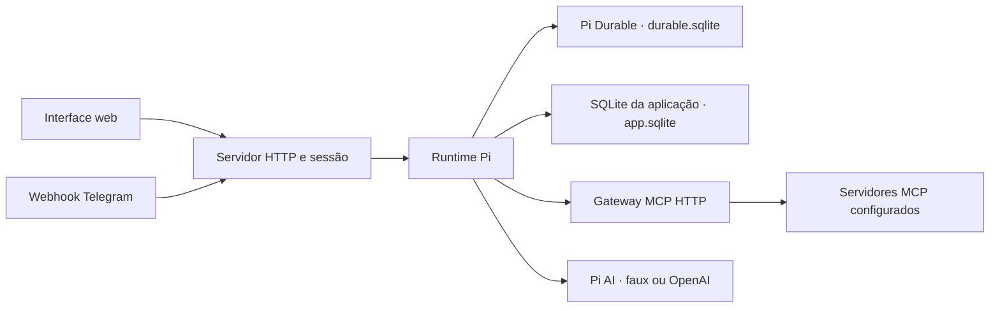

# Arquitetura e limites

## Runtime e dados

Node.js 24 ou superior executa o servidor HTTP, a interface estática e o runtime Pi no mesmo processo. `@earendil-works/pi-durable` 1.0.4 mantém conversas, tarefas e histórico em `durable.sqlite`; `@earendil-works/pi-ai` 1.0.4 fornece o provider faux no modo demo e OpenAI no modo live. As credenciais emitidas pelo login do Pi AI passam por um `CredentialStore` SQLite em `app.sqlite`; não há `auth.json` separado. A base de ações usa `synchronous=FULL`; o adapter Pi usa WAL com `NORMAL`, suficiente para crash do processo, sem garantia de preservar o último commit em falha de energia do host. As duas bases ficam em `DATA_DIR` (localmente `./data`; no Compose `/app/data`).

`app.sqlite` também contém sessões web, requisições idempotentes, leituras MCP, propostas, vínculos de Telegram e fila de entregas. A interface recebe snapshots por SSE, incluindo o texto parcial já persistido, com atualização local a cada 500 ms. O stream encerra quando a sessão expira ou é revogada. O service worker só assume o controle na instalação e ativação; histórico e credenciais sempre vêm do servidor autenticado.

O serviço adquire um `proper-lockfile` em `DATA_DIR/owner.lock` (diretório de lease) dentro do volume de dados antes de abrir e recuperar as bases: heartbeat de 10 s, lock considerado obsoleto após 30 s e nenhuma espera para outra instância. Rode apenas um owner por diretório/volume. No início, ações que ficaram em `running` e entregas que ficaram em `sending` são marcadas `uncertain`; não são repetidas automaticamente. Requisições ainda `pending` são retomadas. A recuperação percorre todas as conversas em páginas de 1.000 registros.

## Login e provider

O login web usa `WEB_PASSWORD` ou `WEB_PASSWORD_FILE` (mínimo de 12 caracteres), limite de tentativas e cookie `HttpOnly`, `SameSite=Strict`, com duração de 24 horas. Requisições de escrita devem trazer a origem exata configurada em `APP_ORIGIN`; `COOKIE_SECURE=true` adiciona o atributo Secure para uso atrás de TLS.

No modo live, a interface inicia `models.login('openai', 'oauth')` do Pi AI e mostra eventos, links de autorização e prompts interativos. O `SqlCredentials` persiste as credenciais do provider em `app.sqlite`. Esse login não é o login web. O modo demo usa respostas locais e não acessa contas externas.

## Ações e MCP

O gateway aceita endpoints HTTPS via Streamable HTTP; HTTP é permitido apenas em loopback para mocks locais. A configuração é um array de servidores com `name`, `url`, `readTools`, `actionTools` e `tokenFile` opcional. Se houver token, o processo o lê como bearer token do arquivo indicado, sem propagá-lo ao agente ou à UI. As chamadas ficam limitadas aos nomes autorizados e o servidor verifica que as ferramentas configuradas existem.

A ferramenta `mcp_tools` expõe somente os nomes aprovados, descrições e schemas de argumentos; URLs e caminhos de secrets não entram no prompt. Pi recebe a instrução de ler contexto externo antes de propor uma ação. Uma leitura bem-sucedida é guardada por conversa, servidor e input ativo; `propose_action` exige evidência da solicitação atual, lida há menos de 10 minutos, e salva essa evidência na proposta revisável. A proposta cria um registro `pending`, mas não chama a ferramenta de escrita. O usuário confirma ou recusa na interface web; no Telegram, `/approve ID` e `/deny ID` decidem propostas pendentes. Anotações MCP são conteúdo não confiável e não são uma fronteira de autorização. Quem configura o servidor deve garantir que cada ferramenta em `readTools` não produza efeitos colaterais.

Estados de ação: `pending`, `running`, `done`, `denied`, `failed`, `uncertain` e `reconciled`. A chamada externa é marcada `running` antes do I/O. Falhas ambíguas viram `uncertain`, sem retry; verifique o serviço externo e só então reconcilie pela interface.

## Telegram

Para ativar o bot, configure token, segredo de webhook, `TELEGRAM_ALLOWED_USERS` e `TELEGRAM_ALLOWED_CHATS`. O serviço recebe POST em `/api/telegram/webhook` e compara o header `x-telegram-bot-api-secret-token`; ele não registra/configura o webhook no Telegram automaticamente. O usuário gera um código na web e envia `/link CODIGO`: o código é de uso único e expira em 10 minutos. Usuário e chat precisam estar nas allowlists. Mensagens dos dois canais usam a mesma conversa.

O bot responde mensagens recebidas e envia respostas concluídas por uma fila persistente. Se o resultado do envio ficar ambíguo, a entrega passa a `uncertain` e não é reenviada automaticamente para evitar duplicação. A aprovação Telegram não usa callback.

## Limites conhecidos

É uma implantação de um operador, uma instância e um diretório de dados; não há RBAC multiusuário nem coordenação entre réplicas. OAuth live e Telegram dependem de credenciais e autorização do operador e ainda não foram validados neste ambiente. A configuração MCP também precisa ser validada contra os servidores reais. A UI carrega o histórico ativo; não há busca ou paginação do histórico na interface.
