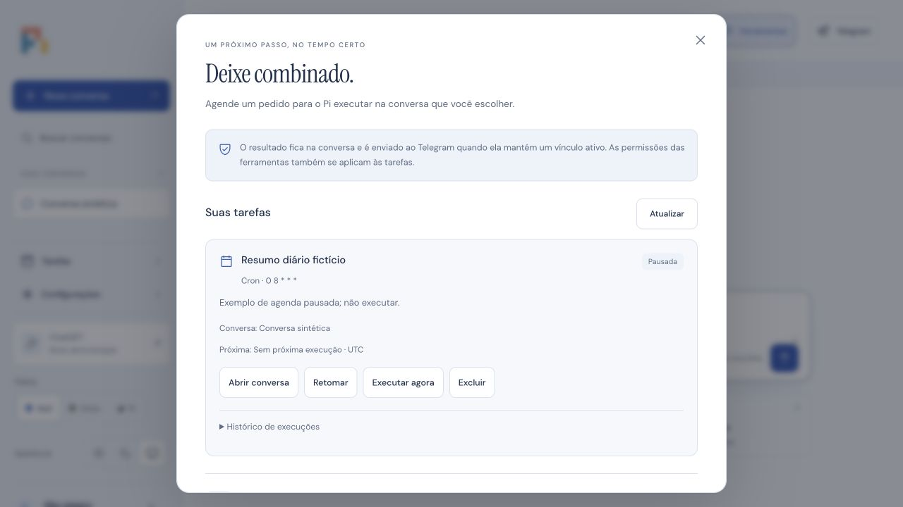

# Resultados de tarefas no Telegram

O agendador já admitia as ocorrências no Pi Durable com `source=task` e `chat=null`. O monitor guardava o resultado na conversa web, mas só criava entregas quando o input tinha chat de origem. Agora uma ocorrência persistida em `task_runs` cria uma notificação terminal própria, sem repetir o prompt, criar outra agenda ou aprovar ferramentas.

## Destino e autorização

O destino elegível é a conversa atualmente mapeada no chat privado da conexão habilitada. O mesmo usuário/chat/conversa precisa constar em `telegram_grants`. A conversa inicialmente escolhida no setup não impede selecionar outra conversa autorizada pelo `/agents`; grants históricos não fazem broadcast. A leitura de roteamento usa apenas metadados públicos do vínculo e nunca consulta tokens ou credenciais do provider.

O recibo `task_notifications` fixa conversa, requestId, usuário, chat e identidade do bot. `task_notification_parts` associa os IDs de cada parte à fila de entregas existente. Se não houver destino autorizado na conclusão, o recibo é `skipped`; reconectar depois não reencaminha esse resultado antigo.

Antes de cada chamada ao transporte, o sender exige vínculo/grant/configuração atuais, ambas as allowlists e a identidade do bot validada por `getMe` na conexão. Triggers SQLite cancelam partes pendentes quando o vínculo/grant é removido ou alterado, ou a conexão é desabilitada, removida, substituída por configuração inválida ou muda de bot/usuário/chat. Restaurar o mesmo vínculo não reativa essas partes. A migração de grants de versões antigas ocorre somente quando a tabela ainda não existe; remover um grant não é desfeito silenciosamente pelo restart.

## Conclusão e recuperação

O monitor lê diretamente a entrada apontada pelo settlement do Durable, inclusive quando o histórico ultrapassa mil entradas. A notificação, todas as partes e a atualização de `requests.status` ficam na mesma transação SQLite. Uma falha local reverte o conjunto: no reinício, o request pendente readmite o mesmo requestId, recupera a resposta já persistida e não executa o modelo como um novo trabalho. Falhas antes da admissão têm recibo e estado do run gravados juntos.

O texto identifica a tarefa e inclui a resposta final. Falhas e conclusões sem texto usam mensagens genéricas, sem erro interno ou dados de credenciais. A formatação e os limites de tamanho usam o renderer HTML seguro do Telegram já existente. O conteúdo completo continua na conversa web; não há envio separado de cada ferramenta nem de cada token de streaming.

Partes `sent`, `cancelled` e `uncertain` nunca são reenviadas automaticamente. Na retomada de um processo interrompido durante `sending`, a fila existente marca a parte como `uncertain`. Uma revogação não desfaz uma chamada já iniciada: a parte pode ter chegado, mas as demais são canceladas. A aplicação não promete exatamente uma entrega perante falha de rede; preserva essa incerteza em vez de repetir um possível efeito externo.

## Validação local

Os testes usam relógio sintético, provider faux, Runtime/SQLite reais e transporte Telegram mock. Cobrem conclusão, histórico extenso, falhas de admissão/execução, vínculo atual e ausência de vínculo, bot/allowlists, revogação e reconexão, partes longas, flush concorrente, deduplicação, migração de grants, rollback após persistir a resposta, retomada de geração interrompida e envios incertos. Não conectam contas, enviam Telegram real nem criam cron do sistema operacional.

A correção SSE foi integrada separadamente ao `main` em `83a2a47` pela PR #4, com CI final aprovado. A entrega de tarefas é um lote isolado; não altera SSE, CSP, configuração de produção ou o estado da aba Safari em diagnóstico.

Verificação concluída em 2026-10-08, na branch local `fix/cron-telegram-delivery`, baseada em `83a2a475c7c905ff4e88089b1447f5ad7b35ceec`:

- `npm run check`, `npm run lint` e `npm run build`: aprovados.
- `npm test`: 176 testes aprovados, nenhuma falha ou teste ignorado, em 33,35 segundos, com Node 26 local.
- Suíte específica `test/task-telegram.test.ts`: 17 testes aprovados em 1,15 segundo.
- Interface verificada no navegador integrado com SQLite temporário, conversa sintética e tarefa pausada. A captura abaixo mostra o aviso de entrega e a agenda; nenhum modelo ou transporte real foi acionado.

O servidor temporário foi encerrado após a verificação. Esta alteração não foi publicada, integrada ou implantada; não muda variáveis de ambiente. Docker não está disponível neste Mac, portanto a imagem/container não foi executada nesta validação local. Entrega em uma conta Telegram real permanece sem validação, conforme o escopo autorizado.
