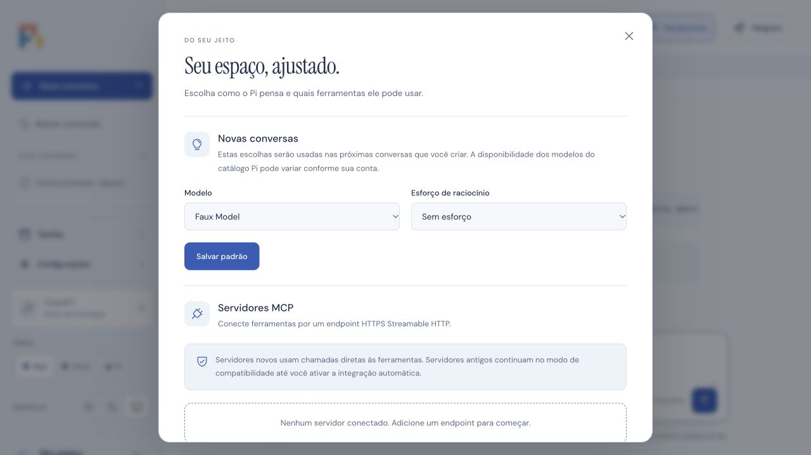

# Safari: cliques sem resposta após rolagem

Coleta de leitura em 8 de outubro de 2026, aproximadamente 17:50–17:57 UTC. A aba existente foi preservada, sem reload, troca de navegador, alteração de segurança, prompt enviado ou execução de tarefa. Nenhuma credencial, cookie ou conteúdo de conversa foi extraído. A entrega de cron ao Telegram foi suspensa antes de mudanças de produção.

## Observações no estado preservado

- O Safari mostrava a interface Pi com o diálogo de tarefas aberto. A árvore de acessibilidade retornava os controles do Safari, mas nenhum controle do documento.
- Solicitar o Console de JavaScript pelo menu Desenvolvedor não abriu um inspetor utilizável. Um clique no botão visível de fechar o diálogo não produziu fechamento verificável e a leitura seguinte retornou `AXError.cannotComplete`.
- A tentativa de rolagem também terminou sem uma mudança visual verificável pela automação. O relato do usuário de que a rolagem continua funcionando é preservado como relato; não foi confirmado por essa interação.
- O Safari principal estava a 0% de CPU. Um processo `com.apple.WebKit.WebContent` (PID 84564) estava a 100% e tinha footprint de 1,2 GiB. O nome do processo, por si só, não identifica sua aba.
- A amostra nativa de três segundos desse processo encontrou 209 amostras na thread principal; 206 estavam diretamente em `WebCore::EventSource::parseEventStream()`, outras duas em listeners desse fluxo, incluindo JSON parse/stringify. A thread `WebCore: Scrolling` era independente e estava aguardando eventos. Isso é compatível com processamento SSE monopolizando a thread que atende cliques e JavaScript, enquanto a rolagem pode continuar em outra thread. A associação desse PID à aba Pi ainda não pôde ser comprovada pelo inspetor.

O arquivo bruto da amostra fica apenas em `/tmp/pi-safari-webcontent-sample.txt`, fora dos entregáveis Git. Capturas da interface real não foram copiadas ao repositório.

## Problema concreto encontrado no código

Em `src/server.ts`, o endpoint de eventos força `dirty = true` a cada 500 ms e escreve um snapshot completo independentemente de ele ter mudado. `Runtime.snapshot()` inclui o estado completo da view e as listas de ações, chamadas/interações MCP e entregas. Em `public/app.js`, o cliente faz JSON parse do evento e depois JSON stringify de todo o snapshot antes de comparar com o anterior. A deduplicação no renderer não evita o tráfego nem o processamento EventSource e JSON.

Isso confirma uma fonte de tráfego e trabalho redundante, mas ainda não prova que o tamanho desse fluxo na conversa real causou o travamento. Não foi lido seu payload. A inspeção de hit-testing, `elementFromPoint`, overlays, listeners e pointer capture ficou bloqueada porque o documento/inspetor não respondeu. Não existe evidência que justifique reduzir a CSP ou atribuir o problema a composição, `sticky`, `fixed` ou ao backdrop.

Uma tentativa posterior abriu a interface do inspetor, mas uma consulta somente de leitura aos IDs dos diálogos, handlers e hit-testing não retornou resultado. Não foram consultados cookies, tokens nem texto de mensagens. A aba de produção continua preservada.

## Correção isolada

Branch `fix/sse-snapshot-dedup`, a partir de `c2f8048`. O servidor compara SHA-256 do JSON completo antes de escrever o snapshot SSE. Guarda apenas o digest por conexão. O poll de 500 ms continua verificando estados que mudam no SQLite sem notificação da view Durable; isso preserva aprovações, chamadas/interações MCP e entregas. O heartbeat continua sendo `: ping` a cada 15 segundos, sem payload de conversa.

O servidor evita serializar novos snapshots enquanto `writableNeedDrain` está ativo. Um `write()` que retorna false já colocou seu snapshot na fila do Node e não é repetido. Ao drenar, o próximo poll entrega o estado mais recente. O limite existente de fila e o encerramento de conexão lenta permanecem. A limpeza dos timers e do watcher foi instalada antes de aguardar o snapshot inicial, evitando vazamento quando o cliente sai durante essa leitura.

O protocolo continua usando snapshots completos, sem IDs de replay nem deltas: cada reconexão recebe o estado atual completo, mesmo se enviar `Last-Event-ID` antigo. Não foram alterados o renderer, a CSP, permissões ou dados persistidos. Ainda existe custo de leitura/serialização no servidor a cada poll e de snapshots completos quando o estado muda; virtualização, paginação e deltas ficam fora deste lote mínimo.

## Medida antes/depois

`test/fixtures/sse-preview.ts` cria duas prévias em loopback, SQLite descartável, modo demo e gateway que recusa execução de ferramentas. O histórico tem 48 entradas sintéticas de assistente e resultados de ferramenta, com **5.251.218 bytes por snapshot**. Nenhum conteúdo de conversa real foi copiado. A versão anterior foi carregada de uma cópia temporária de `src/server.ts` em `c2f8048`.

| Janela de 6,205 segundos, sem mudanças | Antes | Depois |
| --- | ---: | ---: |
| Snapshots completos recebidos | 13 | 1 |
| Bytes SSE recebidos, incluindo protocolo | 68.266.159 | 5.251.255 |

Redução de 92,3% dos bytes nessa janela, incluindo o snapshot inicial. Após o primeiro snapshot, uma conversa ociosa não reenviou histórico; o teste de 15,2 segundos recebeu somente os 8 bytes do heartbeat. Não se trata de medição do payload da conversa privada nem de CPU comparável entre as abas reais.

Para reproduzir a comparação local a partir da raiz do repo:

```sh
git show c2f8048:src/server.ts > src/.sse-baseline.tmp.ts
node --import tsx test/fixtures/sse-preview.ts src/.sse-baseline.tmp.ts
```

As URLs e a senha fictícia são impressas no terminal. A prévia se encerra por Ctrl+C ou após 15 minutos; remova a cópia temporária antes dos checks. Sem argumento, o fixture inicia apenas a versão corrigida.

## Safari e navegador integrado

No Safari, foram abertas abas locais separadas para as versões anterior e corrigida, mantendo a aba real intacta. Na anterior, rolar o histórico, abrir/fechar Configurações e Tarefas e trocar de conversa funcionaram. A árvore de acessibilidade não retornou controles durante uma abertura de Tarefas, mas a captura confirmou que o painel abriu, e seu fechamento e a navegação seguinte funcionaram; isso não foi registrado como travamento total.

Na corrigida, em uma sequência de cerca de dois minutos, rolagens repetidas para cima/baixo, abertura/fechamento de Configurações e Tarefas, alternância de Ferramentas e troca para outra conversa funcionaram. Uma interação de retorno foi interrompida quando o usuário mudou para outra aba; a automação parou de interagir com o Safari. Esse último retorno não foi declarado concluído. Os comandos nunca enviaram mensagens ou criaram/executaram tarefas.

O navegador integrado também abriu o histórico sintético, rolou e abriu Configurações. A captura abaixo contém somente essa prévia, sem abas, conversas ou credenciais privadas:



O cenário sintético não reproduziu o travamento total da aba real. A correção remove uma fonte comprovada de trabalho redundante no caminho observado na amostra nativa; a causalidade completa do incidente de produção continua sem confirmação. Não foi feito reload da aba real, mudança de CSP, deploy, push ou merge.

## Verificação

O teste novo falhou antes da correção: recebeu **5 snapshots em 2,2 segundos**, quando esperava apenas um. Depois, os quatro testes SSE passaram: silêncio em histórico extenso, propagação de streaming/aprovações/MCP/entregas e finalização, reconexão completa, heartbeat, expiração de sessão, desconexão durante snapshot inicial e socket com backpressure real recebendo o último estado após drain.

**159 testes passaram**, sem falhas ou skips, em 34,36 segundos no Node 26 local. Tipos, lint e build passaram. Docker não está disponível localmente e nenhuma imagem ou aplicação de produção foi alterada.
