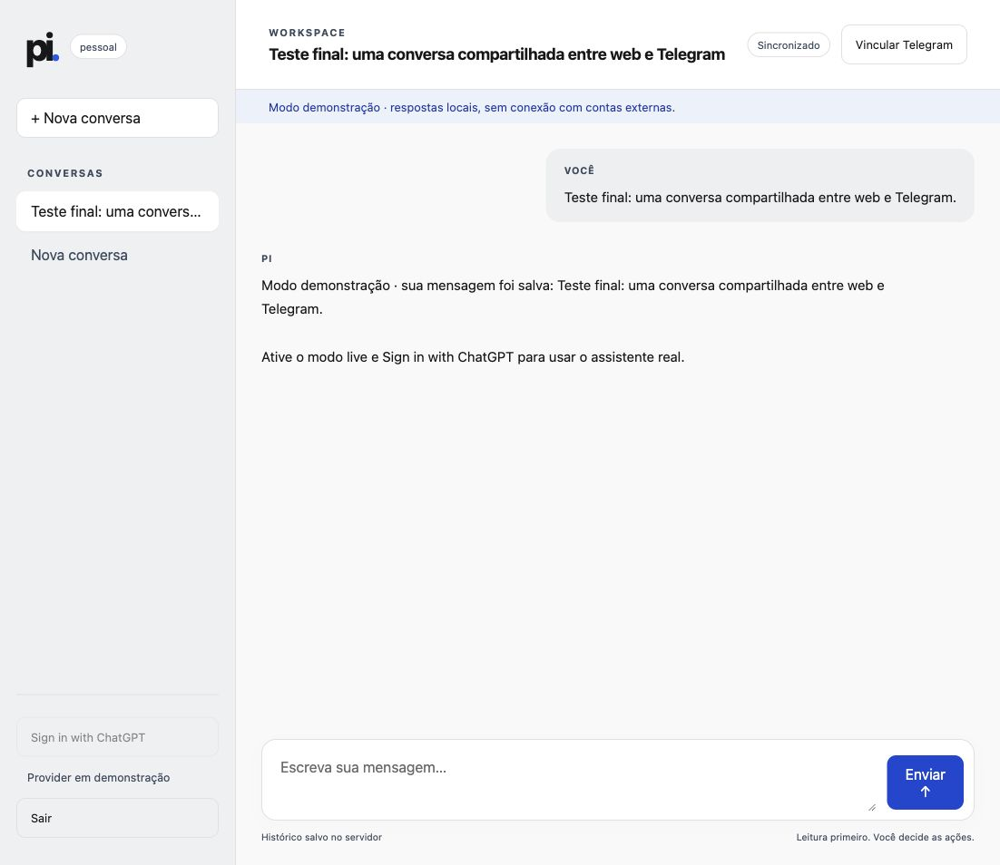
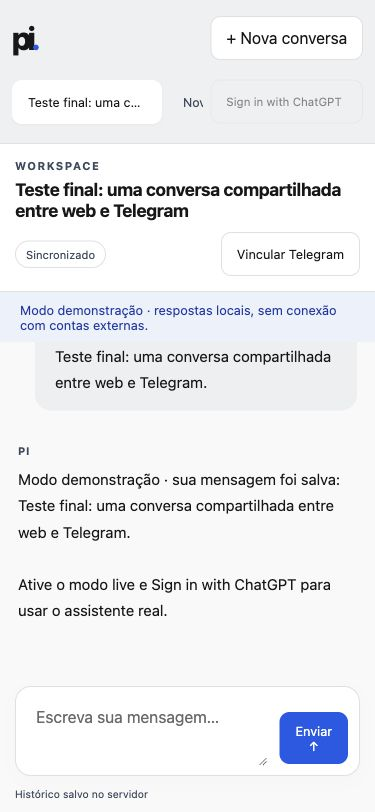
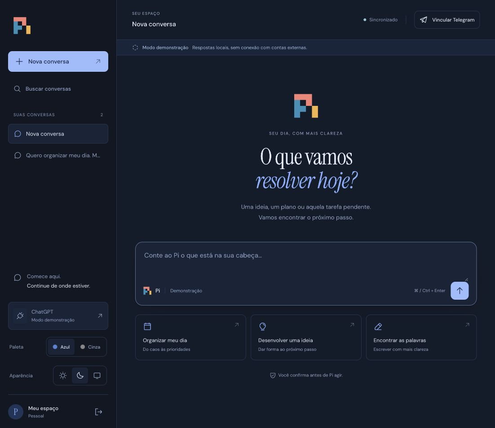
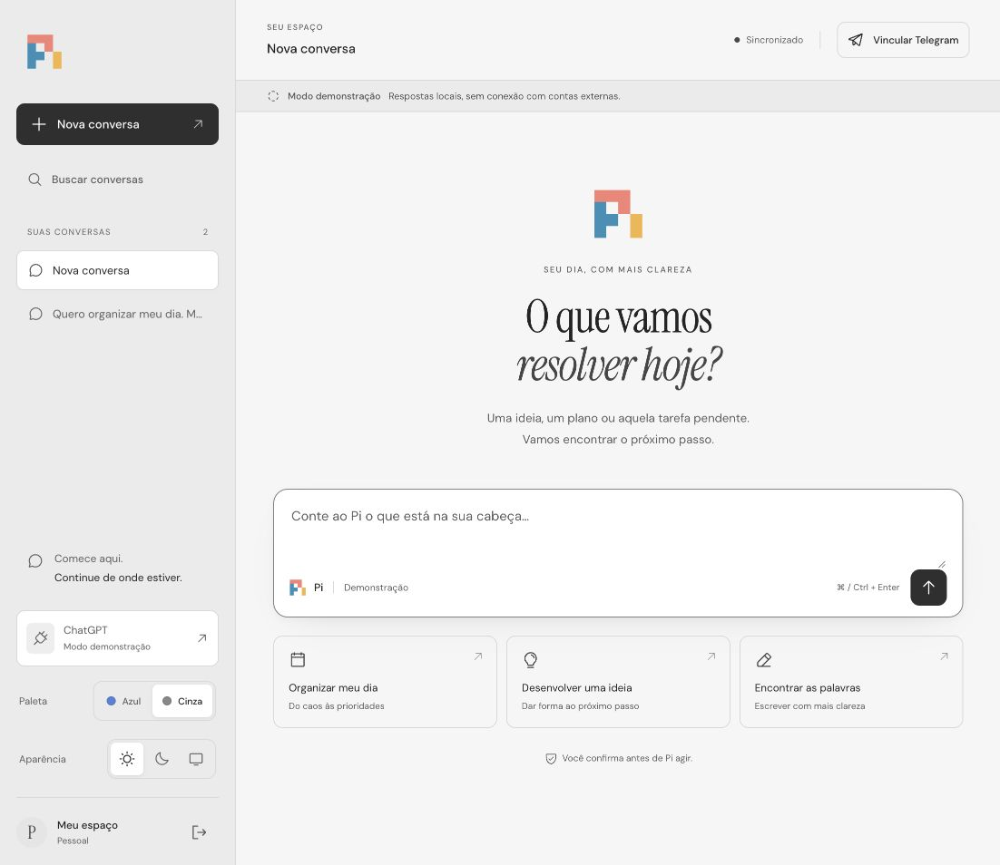
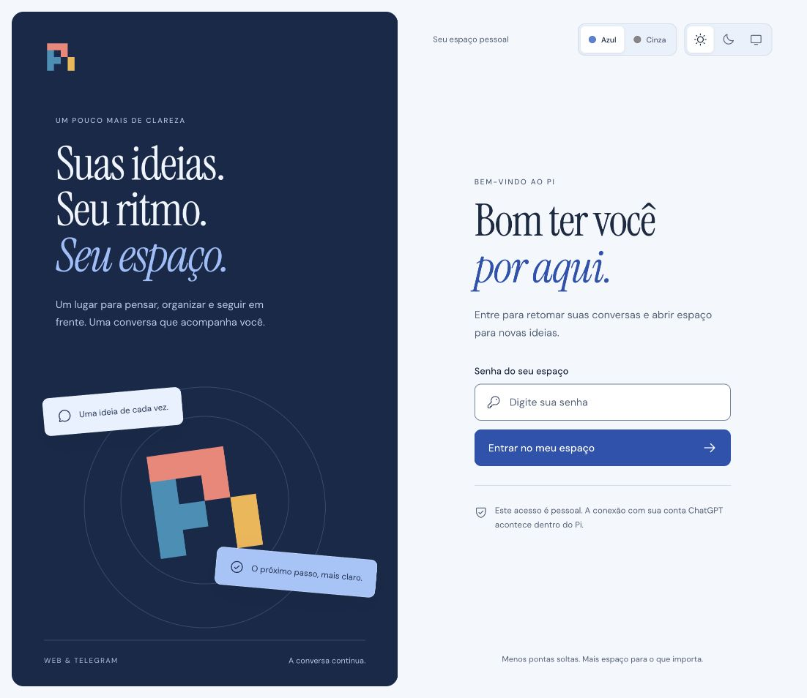

# Verificação local do MVP

Executada em 7 de outubro de 2026, Node.js 26.0.0 / npm 12.0.1, macOS. O alvo de produção no Dockerfile é Node.js 24.

- `npm run check`: passou.
- `npm run lint`: passou.
- `npm run build`: passou; o servidor compilado `node dist/src/main.js` também foi executado.
- `npm test`: 11 testes passaram, nenhum skip, em aproximadamente 32 segundos.
- Sintaxe YAML de `docker-compose.yml` e `.github/workflows/ci.yml`: passou com parser Ruby YAML.
- `npm install`: audit report de zero vulnerabilidades no momento da instalação.

A suíte verifica concorrência e deduplicação por requestId antes e depois de reabrir SQLite; ferramentas MCP ligadas ao Durable; leitura atual por input/servidor; proposta idempotente; aprovação concorrente e recusa duplicada; recuperação de efeitos incertos; allowlists e link Telegram de uso único; entrega e aprovação Telegram duplicadas; OAuth mock com prompt manual e isolamento por sessão; serialização do CredentialStore; autenticação web, Origin, PWA e snapshot SSE ao reconectar.

O teste de crash inicia um processo filho e aplica SIGKILL durante uma geração, uma ação externa e um envio Telegram. Depois de expirar o lease de 30 segundos, a entrada retoma e os efeitos ficam incertos sem replay. O mock MCP usa cliente e servidor oficiais do SDK em loopback; Telegram usa um transporte mock e OAuth não chama OpenAI.

Na interface local foram verificados: login separado do provider, envio de mensagem, resposta demo, histórico após reload e após reinício do processo compilado, nova conversa sem conteúdo anterior, título derivado da primeira mensagem e layout a 375×812 px. A página apresentou largura de conteúdo de 375 px, sem overflow horizontal, e botão de envio visível.

## Limites da verificação

Docker/Compose não estão instalados nesta máquina. Build, healthcheck e permissões do container ainda precisam ser executados em um host com Docker; o workflow local preparado contém esses checks e uma prova de persistência entre recriações do container, mas não foi publicado nem executado no GitHub.

OAuth ChatGPT, MCPs externos e Telegram reais não foram conectados. Nenhuma mensagem Telegram real foi enviada, nem webhook registrado, nem deploy realizado. Não houve push ou merge.

A implantação é para um operador e uma instância, com configuração MCP revisada pelo operador. A credencial OAuth fica em SQLite no volume protegido. O adapter Durable usa WAL/NORMAL: a retomada de processo foi verificada, mas a garantia não cobre o último commit em perda de energia do host. Ações/entregas usam um ledger com synchronous=FULL.

## Refinamento visual: paletas e modos de aparência

Em 7 de outubro de 2026, a interface foi redesenhada a partir das referências registradas em [design.md](design.md). A entrega atual usa somente o logo oficial na marca, ícones Phosphor e fontes locais. As paletas Azul e Cinza funcionam em Claro, Escuro e Automático.

- `npm run check`, `npm run lint`, `npm run build` e `git diff --check`: passaram.
- Suíte final: **14 testes passaram**, nenhum skip/fail, em aproximadamente 32 segundos. Os três testes novos verificam acompanhamento de mudanças do sistema, escolha manual persistida, sincronização entre abas, preferências inválidas, armazenamento indisponível e independência entre paleta e luminosidade.
- No navegador: entrada, seleção dos quatro pares de paleta/tema, persistência após reload, sugestões, envio por Ctrl+Enter, busca de conversas, nova conversa, diálogo Telegram, menu móvel, contenção de foco e Escape foram verificados. Uma confirmação foi exercitada contra um gateway local simulado, sem chamada externa.
- Layouts inspecionados em 375×812, 768×1024, 1024×768, 1440×900 e 812×375. Nenhum apresentou overflow horizontal. A navegação permite rolagem quando a altura é pequena.
- Cores secundárias e bordas foram ajustadas após medição de contraste. Texto normal usa pares com ao menos 4,5:1; campos principais, ao menos 3:1 nas bordas. A preferência por movimento reduzido desativa animações e transições no CSS.
- Console sem erros durante a navegação principal. Logo, favicon, ícones, fontes e scripts são servidos localmente sob a política CSP existente.

Capturas da interface atual:

A prévia usa dados descartáveis em `/tmp/pi-agent-redesign-demo`, com respostas locais de demonstração. Contas e serviços reais continuam desconectados.
