# Verificação local do MVP

## MCP direto: verificação mais recente

Em 7 de outubro de 2026, Node.js 26.0.0, a suíte completa passou com **49 testes**, sem falhas ou skips. Tipos, lint, build, sintaxe dos scripts web e `git diff --check` passaram.

A cobertura adicionada inclui descoberta paginada e isolamento de falhas; restrições opcionais e precedência de bloqueios; fallback SSE somente em HTTP 404/405; ferramentas MCP chamadas diretamente pelo Durable; formulários/URLs nativos sem aceitação automática; pausa/retomada persistida, decisões duplicadas e transações interrompidas; rotação de credencial; cancelamento de solicitações retiradas pelo servidor; recuperação de resultados grandes; e SIGKILL durante uma chamada direta sem replay do efeito.

Na interface compilada com dados e senha descartáveis em loopback, foram verificados login, descoberta, salvamento com atualização automática do catálogo e resposta a formulário MCP nativo. O formulário exibiu campos do schema do servidor; após preencher e aceitar a solicitação do mock, ela saiu do estado pendente e o servidor mock confirmou a decisão. Nenhum serviço externo, conta real ou credencial real foi utilizado.

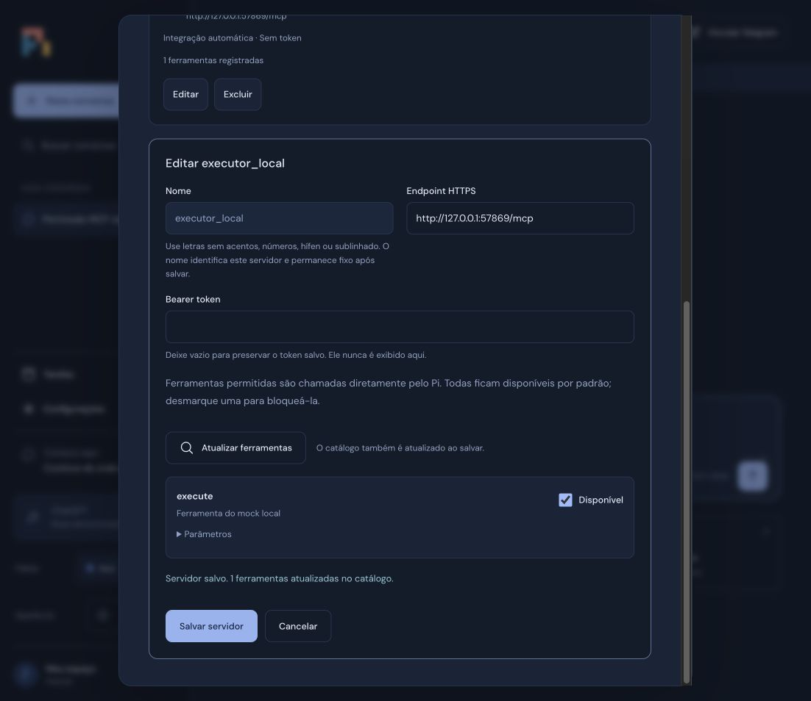

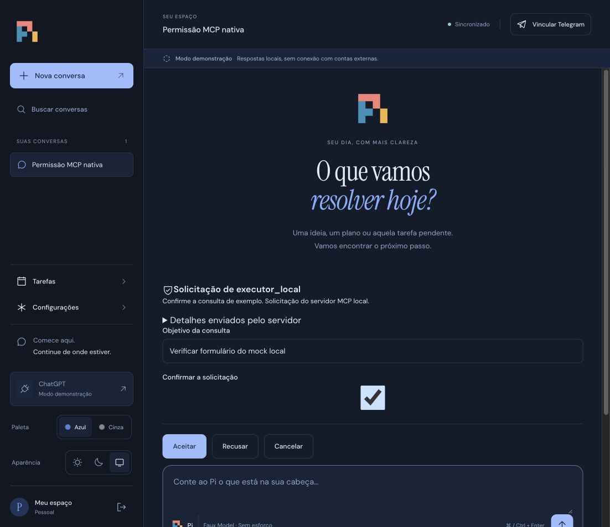

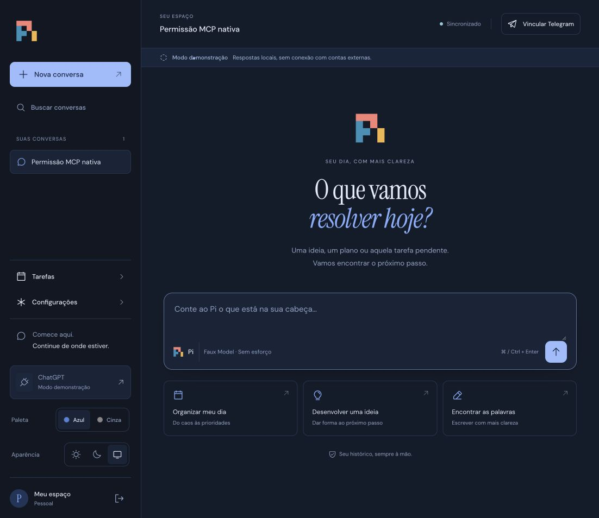

O Executor real ainda precisa ser validado com seu endpoint e schema de pausa. Transporte stdio e OAuth de servidor MCP não fazem parte desta implementação; o cliente usa bearer token provisionado. Docker não está disponível nesta máquina, portanto não houve novo build de container. As verificações anteriores abaixo permanecem como histórico.

Executada em 7 de outubro de 2026, Node.js 26.0.0 / npm 12.0.1, macOS. O alvo de produção no Dockerfile é Node.js 24.

- `npm run check`: passou.
- `npm run lint`: passou.
- `npm run build`: passou; o servidor compilado `node dist/src/main.js` também foi executado.
- `npm test`: 11 testes passaram, nenhum skip, em aproximadamente 32 segundos.
- Sintaxe YAML de `docker-compose.yml` e `.github/workflows/ci.yml`: passou com parser Ruby YAML.
- `npm install`: audit report de zero vulnerabilidades no momento da instalação.

A suíte verifica concorrência e deduplicação por requestId antes e depois de reabrir SQLite; ferramentas MCP ligadas ao Durable; leitura atual por input/servidor; proposta idempotente; aprovação concorrente e recusa duplicada; recuperação de efeitos incertos; allowlists e link Telegram de uso único; entrega e aprovação Telegram duplicadas; OAuth mock com prompt manual e isolamento por sessão; serialização do CredentialStore; autenticação web, Origin, PWA e snapshot SSE ao reconectar.

O teste de crash inicia um processo filho e aplica SIGKILL durante uma geração, uma ação externa e um envio Telegram. Depois de expirar o lease de 30 segundos, a entrada retoma e os efeitos ficam incertos sem replay. O mock MCP usa cliente e servidor oficiais do SDK em loopback; Telegram usa um transporte mock e OAuth não chama OpenAI.

Na interface local foram verificados: login separado do provider, envio de mensagem, resposta demo, histórico após reload e após reinício do processo compilado, nova conversa sem conteúdo anterior, título derivado da primeira mensagem e layout a 375×812 px. A página apresentou largura de conteúdo de 375 px, sem overflow horizontal, e botão de envio visível.

## Limites da verificação

Docker/Compose não estão instalados nesta máquina. Build, healthcheck e permissões do container ainda precisam ser executados em um host com Docker; o workflow local preparado contém esses checks e uma prova de persistência entre recriações do container, mas não foi publicado nem executado no GitHub.

OAuth ChatGPT, MCPs externos e Telegram reais não foram conectados. Nenhuma mensagem Telegram real foi enviada, nem webhook registrado, nem deploy realizado. Não houve push ou merge.

A implantação é para um operador e uma instância, com configuração MCP revisada pelo operador. A credencial OAuth fica em SQLite no volume protegido. O adapter Durable usa WAL/NORMAL: a retomada de processo foi verificada, mas a garantia não cobre o último commit em perda de energia do host. Ações/entregas usam um ledger com synchronous=FULL.

## Refinamento visual: paletas e modos de aparência

Em 7 de outubro de 2026, a interface foi redesenhada a partir das referências registradas em [design.md](design.md). A entrega atual usa somente o logo oficial na marca, ícones Phosphor e fontes locais. As paletas Azul e Cinza funcionam em Claro, Escuro e Automático.

- `npm run check`, `npm run lint`, `npm run build` e `git diff --check`: passaram.
- Suíte final: **14 testes passaram**, nenhum skip/fail, em aproximadamente 32 segundos. Os três testes novos verificam acompanhamento de mudanças do sistema, escolha manual persistida, sincronização entre abas, preferências inválidas, armazenamento indisponível e independência entre paleta e luminosidade.
- No navegador: entrada, seleção dos quatro pares de paleta/tema, persistência após reload, sugestões, envio por Ctrl+Enter, busca de conversas, nova conversa, diálogo Telegram, menu móvel, contenção de foco e Escape foram verificados. Uma confirmação foi exercitada contra um gateway local simulado, sem chamada externa.
- Layouts inspecionados em 375×812, 768×1024, 1024×768, 1440×900 e 812×375. Nenhum apresentou overflow horizontal. A navegação permite rolagem quando a altura é pequena.
- Cores secundárias e bordas foram ajustadas após medição de contraste. Texto normal usa pares com ao menos 4,5:1; campos principais, ao menos 3:1 nas bordas. A preferência por movimento reduzido desativa animações e transições no CSS.
- Console sem erros durante a navegação principal. Logo, favicon, ícones, fontes e scripts são servidos localmente sob a política CSP existente.

Capturas da interface atual:

A prévia usa dados descartáveis em `/tmp/pi-agent-redesign-demo`, com respostas locais de demonstração. Contas e serviços reais continuam desconectados.

## Tema Pi e atalhos do compositor

Verificação em 8 de outubro de 2026, Node.js 26.0.0 no macOS; o container continua usando Node.js 24.

- `npm run check`, `npm run lint`, `npm run build` e `git diff --check`: passaram.
- **54 testes passaram**, nenhum skip/fail. A suíte inclui Enter para enviar, Ctrl+Enter para inserir nova linha no cursor, proteção contra composição IME, envios repetidos e requisições simultâneas. O teste adicional de aparência verifica Pi após reload, Claro/Escuro/Automático, mudança do sistema, sincronização entre abas e armazenamento indisponível; Azul/Cinza continuam cobertos.
- No navegador local: entrada, conversa e configurações, Pi claro/escuro/automático, persistência após reload e logout, alternância para Azul/Cinza e retorno ao Pi. O modo automático resolveu a aparência clara do sistema; mudanças para sistema escuro e escolhas manuais foram exercitadas no teste automatizado.
- Desktop 1280×720, celular 375×812 e entrada em 812×375: sem overflow horizontal. Os seletores quebram linhas quando necessário e o menu permite rolagem. Console sem erros durante a conferência.
- Dez pares de texto/superfície medidos em cada modo Pi: contraste mínimo **5,37:1 no claro** e **5,33:1 no escuro**. Campos de configurações e seletores de aparência usam bordas fortes. A grade usa CSS estático e os efeitos continuam respeitando movimento reduzido.
- A prévia utilizou apenas demonstração em loopback e dados descartáveis, sem conectar contas ou enviar mensagens a serviços externos.

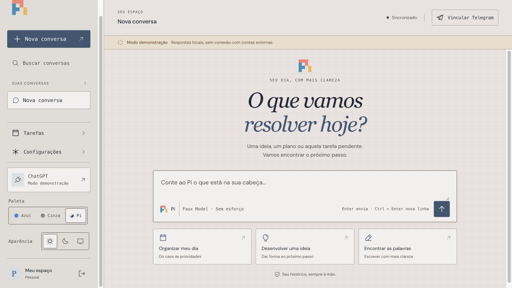

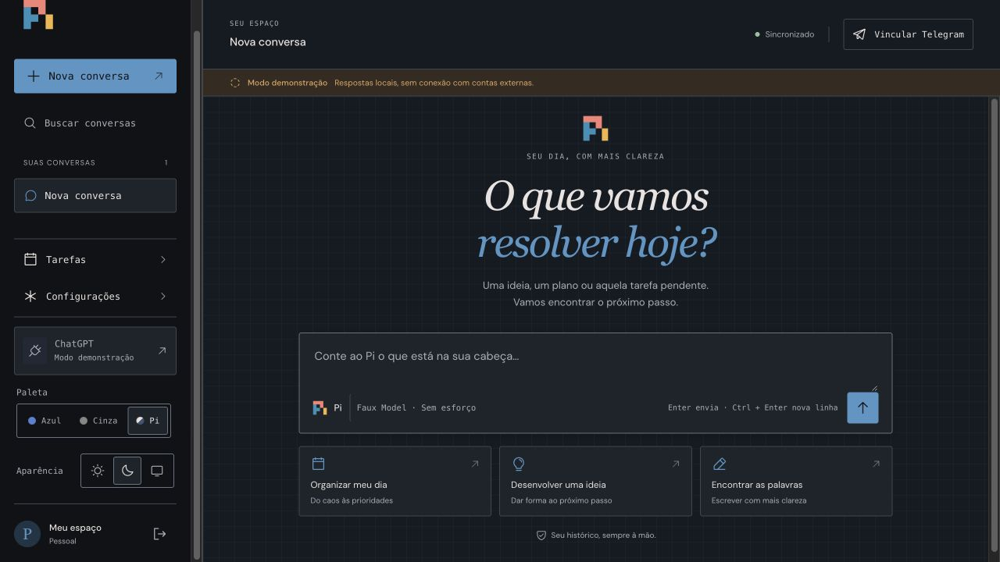

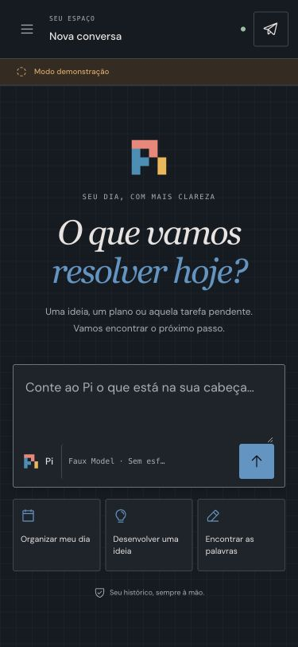

## Tarefas pelo chat e Markdown

Verificação local em 8 de outubro de 2026, na branch `fix/chat-tasks-markdown`.

- Causa de agenda: o servidor HTTP instanciava o agendador, mas `personal-assistant` não registrava ferramentas de tarefas. O teste inicial confirmou `tasks_create` ausente do agente. O runtime agora possui o agendador compartilhado e registra `tasks_list` e `tasks_create` sem depender de configuração MCP ou habilitação por conversa.
- **66 testes passaram**, zero fail/skip, em 32,65 segundos. Incluem chamadas pelo provider faux, cron às 8h em `America/Sao_Paulo`, resultados com ID persistido, reabertura, MCP direct e refresh, bloqueio de criação em entradas task/system, validação de fuso/cron, criação concorrente idempotente, recibos e rollback. O novo teste SIGKILL mata o processo após o commit da tarefa e antes do resultado da ferramenta: o replay retorna a tarefa original mesmo depois de expirar sua data única.
- Causa de formatação: histórico e texto parcial usavam `textContent`, exibindo Markdown literalmente. Os dois caminhos agora usam o mesmo lexer Marked e renderer DOM. Testes cobrem parágrafos, títulos, negrito, listas aninhadas, código, links e sintaxe parcial; HTML bruto vira texto, imagens não carregam e URLs executáveis/credenciadas são rejeitadas. O teste HTTP verifica os dois módulos ESM permitidos e rejeita acesso genérico a node_modules.
- Na prévia isolada com provider mock: respostas parciais e histórico após reload tinham elementos de título, listas, negrito e código. Código inline permaneceu inline, sem caixa duplicada no bloco de código. A agenda criada pelo chat apareceu no painel **Tarefas** com cron e fuso corretos. Desktop 1280×720 e celular 375×812 não tiveram overflow horizontal; console sem erros. A prévia usou somente dados temporários, sem conta real, MCP externo ou envio Telegram.
- O anexo `image(5).png` não pôde ser inspecionado: duas tentativas de download pela Library devolveram HTTP 403. Nenhuma conclusão visual sobre esse anexo foi usada; a reprodução e as capturas abaixo são da prévia local.
- A exigência de intenção explícita para agendar consta nas instruções ao modelo; o backend valida a origem da entrada ativa, esquema, cron e fuso. Ele não faz análise semântica do pedido humano. Permissões MCP e aprovações de efeitos externos continuam inalteradas. O recibo de criação cobre chamadas duráveis do chat; o formulário HTTP anterior ainda não fornece uma chave de retry de criação.
- Esta correção foi preparada localmente; não houve push, merge ou deploy. Contas e serviços reais não foram usados para a validação, e o build de container deste lote não foi executado nesta máquina.

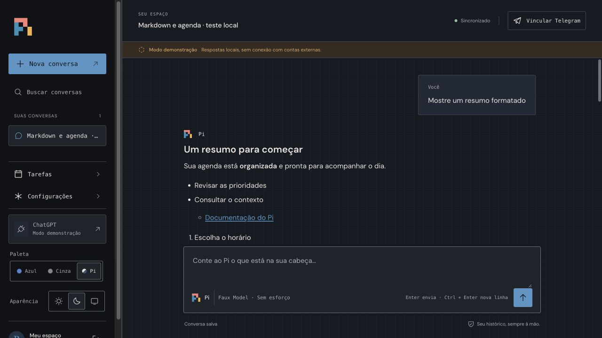

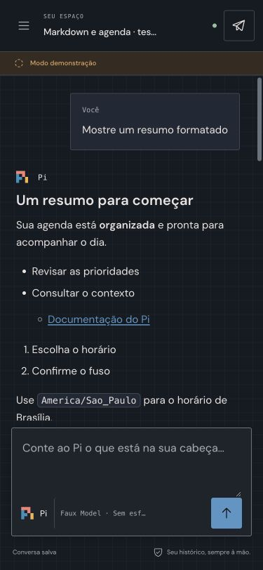

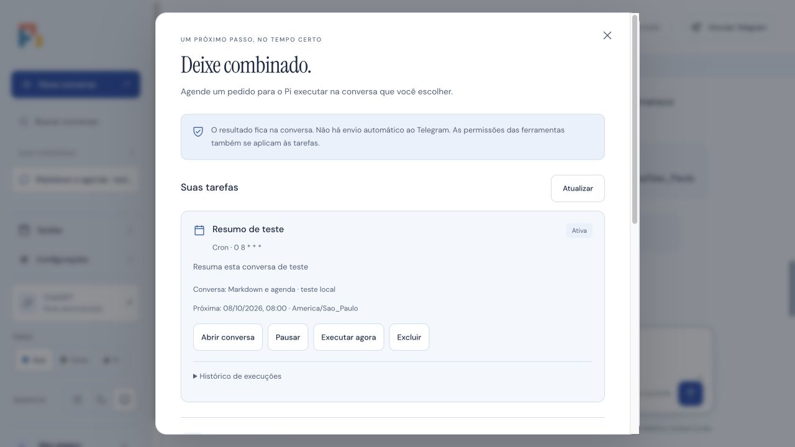

## Comandos web e Telegram

Estado final verificado em 8 de outubro de 2026, na branch local `feat/web-telegram-slash`, partindo de `74f1d1e`.

- **84 testes passaram**, zero falhas e zero testes ignorados, em 32,80 segundos, depois da correção final de `outcome.result.entryId`. `npm run check`, `npm run lint`, `npm run build` e `git diff --check` também passaram. A execução local usou Node 26; o container Node 24 não foi reconstruído neste lote.
- Os testes de comandos verificam despacho antes do modelo, catálogo e esforços suportados pelo Pi, escape de barra literal, comandos inválidos, colisão entre mensagem e comando, concorrência, recibos após reinício e repetição de alterações antigas. Uma compactação vazia retorna `noop` sem invocar o provider e sem afirmar que criou um resumo.
- HTTP exige sessão e protege mutações por origem. Telegram preserva as allowlists e o vínculo de uso único, acrescenta grants por usuário/chat/conversa e verifica fingerprints dos updates. Os testes mostram que `/agents` e `/crons` respeitam o conjunto autorizado; agendas não vinculadas não aparecem. `/tasks` aplica o mesmo conjunto às execuções do Harness. Respostas e erros de comandos usam entregas persistentes e são deduplicados, incluindo envios incertos.
- O SIGKILL ocorre depois da admissão de uma compactação real no Durable e antes do recibo: a tarefa permanece na base e repetir o comando não admite outra. `/stop` interrompe execução e fila, preserva a agenda futura e não reaplica um comando antigo contra trabalho novo. Uma chamada ao SDK MCP mock interrompida fica incerta, com efeito contado uma vez mesmo após reinício. As regressões de aprovações duplicadas e recuperação anterior continuam passando.
- Na interface final em modo demo: sugestões por `/`, seleção por teclado sem envio, toque no celular, seletor de modelo e acompanhamento da compactação até **Sem alterações**. Desktop 1280×720 e celular 390×844 foram conferidos; o menu respeita o espaço acima do compositor, sem sobrepor o cabeçalho nem causar overflow horizontal. Temas claro e escuro usam as paletas existentes. Console sem erros na conferência final. Os testes automatizados também cobrem Ctrl+Enter, Shift/Alt+Enter, Shift+Tab, IME, Escape, tecla repetida e respostas atrasadas.
- A validação usou contas e transportes mock/demonstração, sem conectar ChatGPT real ou enviar Telegram real. A aba e o processo da prévia na porta 3144 foram encerrados e o viewport foi restaurado. Não houve push, merge, execução de crons reais ou deploy. A compactação tem o limite de admissão incerta documentado em [comandos](slash-commands.md); esse estado não dispara replay cego.

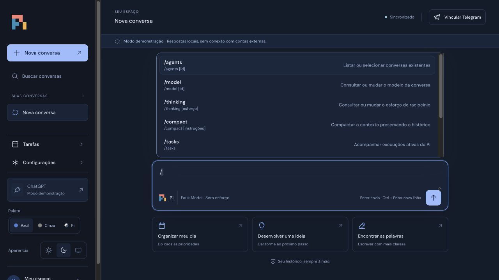

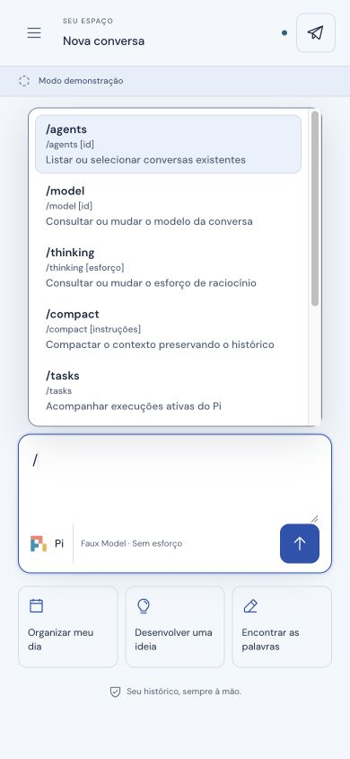

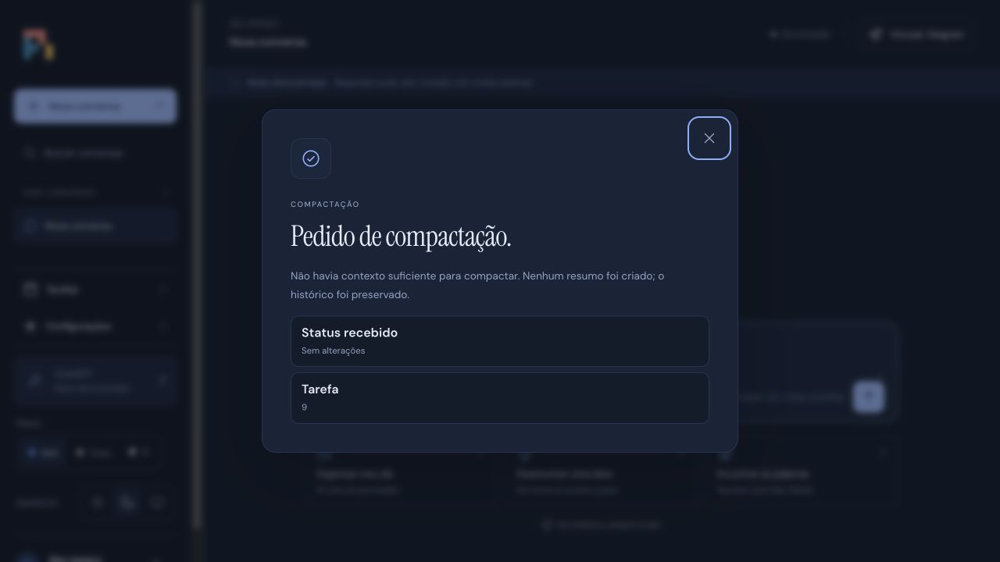

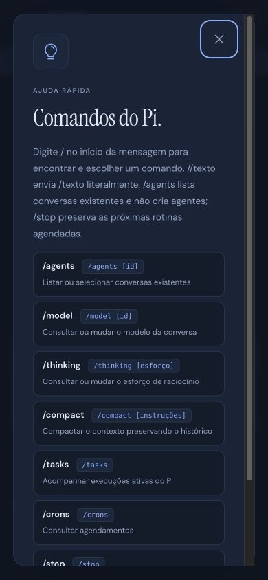

## Correção do vínculo Telegram após o dispatcher de comandos

Em 8 de outubro de 2026, na branch local `fix/telegram-pairing-dispatch`, partindo de `7b73215`: **90 testes passaram**, zero falhas e zero skips, em 32,75 segundos. `npm run check`, `npm run lint`, `npm run build`, `node --check public/app.js`, `git diff --check` e a leitura do Compose com Ruby YAML passaram. Node local: 26.0.0. Docker não está disponível nesta máquina; o container desta revisão não foi reconstruído nem publicado.

O caminho literal `/link CODIGO` já era tratado antes do modelo. Foram reproduzidas duas falhas no código: colar o comando no chat web produz o erro de comando desconhecido; no Telegram, o teste literal de prefixo não reconhece espaços iniciais, `/link@BOT` nem `/start CODIGO`. O payload e o canal do incidente real não foram fornecidos, portanto a investigação não atribui uma dessas variantes ao usuário. A correção cobre essas entradas e mantém a rejeição de comandos desconhecidos.

O teste de integração executa os handlers reais de abrir/copy do diálogo contra a API HTTP autenticada em loopback; entrega o texto copiado ao webhook com transporte mock; verifica segredo do webhook, allowlists, vínculo da mesma conversa, consumo único e ausência de chamada ao provider. Outros testes exercitam `/start` sem grant, payload e sufixo do próprio bot, outro bot ignorado, código expirado/inválido, fingerprints, duplicação concorrente, recibos após reinício, impossibilidade de reverter um vínculo posterior por retry antigo, envio incerto sem replay e rollback de vínculo/grant/recibo/confirmação quando o armazenamento da entrega falha. Mensagens com escape explícito `//` preservam seu conteúdo e espaços; somente comandos são normalizados.

Na prévia local, o diálogo, a confirmação **Comando copiado**, o link de abertura e a orientação ao colar o comando na web foram verificados. Desktop 1280×720 e mobile 390×844; largura da página no celular: 390 px, sem overflow. O link tem alvo de toque de 44 px e o diálogo cabe no viewport. Console sem erros. Os códigos nas capturas são descartáveis de uma base local apagada ao encerrar a prévia; nenhum token ou conta real foi usado. O link `t.me` não foi aberto. A aba e o processo temporários foram encerrados e o viewport restaurado. Nenhum webhook foi registrado, nenhuma mensagem real enviada, e não houve push/merge/deploy.

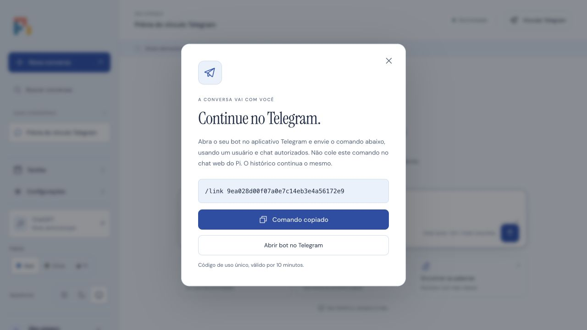

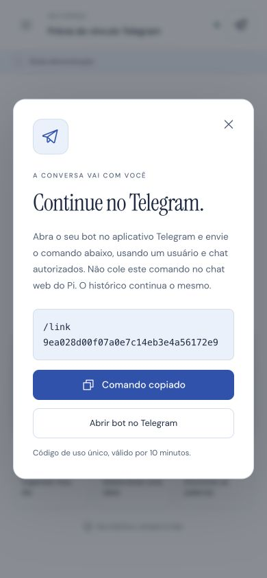

