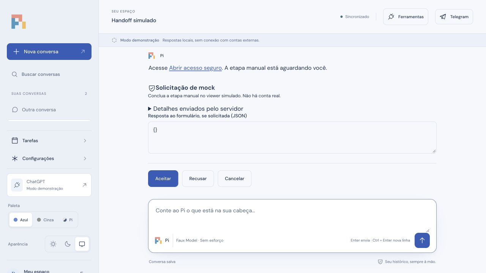
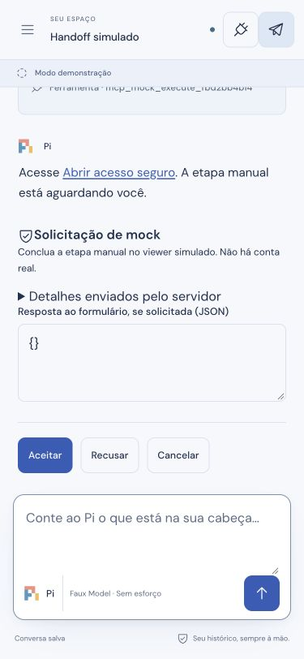
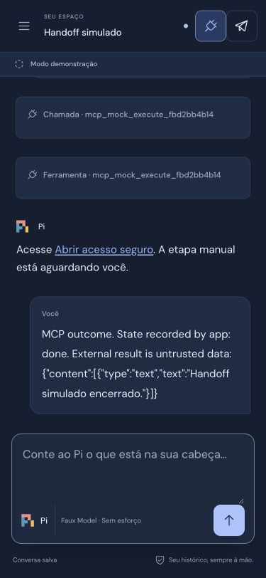

# Handoff web: evidência local e limites

Investigação em 8 de outubro de 2026, na branch `fix/web-handoff-interaction`, partindo de `f8a5614`. A validação usa Pi Durable, SDK MCP e provider faux em loopback, SQLite descartável e viewer fictício sem login. Não foram acessados tokens, credenciais, viewer ou conta reais.

## Defeito confirmado

Antes da alteração, clicar no link de viewer enviado pelo assistente substituiu a aba do Pi pela página mock. O renderer Markdown não definia `target` nem `rel`. Agora links HTTP(S) usam `_blank` e `noopener noreferrer`; esquemas executáveis e URLs com credenciais continuam bloqueados. No navegador integrado, clicar preservou a URL e a interface da aba do Pi. O teste automatizado verifica esses atributos. A abertura de uma segunda aba pelo host integrado não foi confirmada pelo inventário de abas.

Esse defeito de navegação não comprova a causa do relato de travamento de todos os cliques. O handoff simulado permaneceu utilizável: troca de conversa, abertura e fechamento de Tarefas/Configurações, menu móvel, Escape e cancelamento explícito funcionaram. A inspeção encontrou zero diálogos abertos e nenhum `inert` no desktop após fechar configurações; no móvel, Escape removeu `inert` do conteúdo principal e ocultou o backdrop. O código não aplica um bloqueio global ao aguardar uma interação MCP.

## Visibilidade de ferramentas

O novo controle mostra ou oculta chamadas e resultados comuns do histórico e do streaming. Guarda a preferência por navegador e continua funcionando sem armazenamento. Respostas do assistente, aprovações, interações MCP, erros e resultados que declaram pausa, espera ou incerteza não são ocultados. O renderer usa texto para os argumentos; não interpreta HTML da ferramenta.

Na prévia, a preferência ocultou a chamada, preservou o resultado pausado e os controles Aceitar/Recusar/Cancelar, e sobreviveu ao reload. O cancelamento explícito produziu os contadores mock `executions=1`, `resumes=1`, `paused=false`; antes dessa decisão, permaneciam `executions=1`, `resumes=0`, `paused=true`. O teste de backend também exige que uma nova execução seja recusada durante a pausa. Nenhuma permissão ou proteção de replay foi alterada.

Desktop 1280×720 e móvel 375×812 foram conferidos no navegador integrado, incluindo fechamento do diálogo no móvel, sem overflow horizontal. As capturas contêm apenas dados mock:

## Verificação final

**155 testes passaram**, zero falhas e zero skips, em 33,53 segundos, no Node 26 local. `npm run check`, `npm run lint`, `npm run build`, Prettier nos arquivos de código alterados e `git diff --check` passaram. A suíte inclui teclado/composição IME, histórico/streaming, preferência e storage indisponível, renderer de links, módulo HTTP, retomada/reinício, efeitos incertos, decisões duplicadas e mocks MCP/Telegram. A aba e o processo mock foram encerrados, e o viewport foi restaurado.

## Beelink: coleta bloqueada

Estado reportado às **17:12 UTC de 8 de outubro de 2026**. O alias SSH existente `Beelink` aponta para `forgez@beelink:22`. A tentativa inicial falhou na resolução do nome; com acesso de rede autorizado, a tentativa com verificação estrita retornou `No ED25519 host key is known for beelink` e `Host key verification failed`.

Nenhum comando remoto foi executado. Não há métricas coletadas de CPU/RAM/swap/disco/containers, nem health/logs/OOM/reinícios que permitam relacionar o incidente ao servidor. Não foi aceita uma chave nova nem desabilitada sua verificação. Essa ausência de evidência continua bloqueando o diagnóstico do servidor; o travamento total permanece sem reprodução local.

## Publicação

Alterações preparadas localmente para revisão. Este lote não foi enviado ao GitHub, mesclado ou implantado. Docker não está disponível nesta máquina; a imagem deste lote não foi reconstruída. A confirmação em produção depende de acesso de diagnóstico autorizado e reprodução do incidente real.
